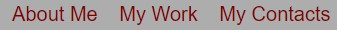
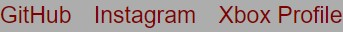

# My-Portfolio-HTML-CSS

Link to my project: [My-Portfolio-HTML-CSS](https://kmphillips20.github.io/My-Portfolio-HTML-CSS/)

## Table of Contents
- [Description](#description)
- [Visuals](#visuals)

## Description
In this project I have built a profile about myself. I have a Bio description about myself, I have a work section where you can click on the pictures and check out some of the work I have done, and last at the bottom of the page I have contacts so you can contact me at some of my soical media. 

## Visuals
1. this is at the top of the page that when you click on these it jumps to that part of the page

2. These are the three pictues that have links to them when clicked on

3. this is at the bottom of the page that when you click on these it goes to that profile of mine

